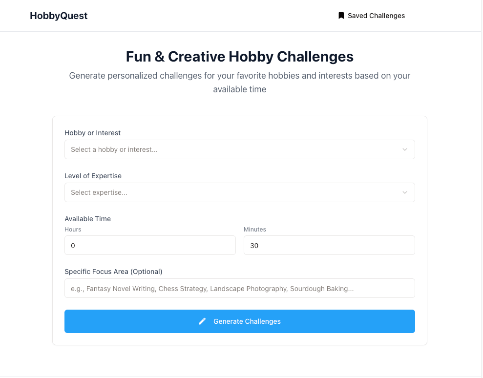

# HobbyQuest

An AI-powered application that generates personalized fun and creative challenges based on your hobbies and interests.



## Features

- **Personalized Hobby Challenges**: Generate creative challenges tailored to your specific hobbies and interests
- **Time-Specific**: Set how much time you have available, and get challenges that fit your schedule
- **Expertise Levels**: Whether you're a beginner or an expert, get challenges appropriate for your skill level
- **Save Favorites**: Bookmark challenges you want to try later
- **Track Progress**: Mark challenges as complete when you finish them

## Technologies Used

- **Frontend**: React, TypeScript, Tailwind CSS, shadcn/ui
- **Backend**: Express.js, Node.js
- **API Integration**: OpenAI API for generating personalized challenges
- **State Management**: React Query, React Context

## Self-Hosting Guide

### Prerequisites

- Node.js 18+ installed on your system
- An OpenAI API key

### Installation

1. **Clone the repository**

```bash
git clone https://github.com/yourusername/hobbyquest.git
cd hobbyquest
```

2. **Install dependencies**

```bash
npm install
```

3. **Set up environment variables**

Create a `.env` file in the root directory with the following content:

```
OPENAI_API_KEY=your_openai_api_key
```

Replace `your_openai_api_key` with your actual OpenAI API key.

### Running Locally

1. **Start the development server**

```bash
npm run dev
```

2. **Access the application**

Open your browser and navigate to `http://localhost:5000`

### Building for Production

1. **Create a production build**

```bash
npm run build
```

2. **Start the production server**

```bash
npm start
```

## Deployment Options

### Option 1: Deploy to a VPS or Dedicated Server

1. Set up a server with Node.js installed
2. Clone your repository to the server
3. Install dependencies with `npm install`
4. Create a production build with `npm run build`
5. Use a process manager like PM2 to keep your application running:

```bash
npm install -g pm2
pm2 start npm --name "hobbyquest" -- start
```

6. Set up a reverse proxy with Nginx or Apache to handle requests

### Option 2: Deploy to Vercel

1. Push your code to GitHub
2. Connect your GitHub repository to Vercel
3. Set up your environment variables in the Vercel dashboard
4. Deploy your application

### Option 3: Deploy to Heroku

1. Create a `Procfile` in the root directory with this content:
   ```
   web: npm start
   ```
2. Push your code to GitHub
3. Create a new Heroku app and connect it to your GitHub repository
4. Set the `OPENAI_API_KEY` environment variable in the Heroku dashboard
5. Deploy your application

## Project Structure

```
hobbyquest/
├── client/                   # Frontend code
│   ├── src/
│   │   ├── components/       # React components
│   │   ├── hooks/            # Custom React hooks
│   │   ├── lib/              # Utility functions
│   │   ├── pages/            # Page components
│   │   ├── App.tsx           # App component
│   │   └── main.tsx          # Entry point
│   └── index.html            # HTML template
├── server/                   # Backend code
│   ├── index.ts              # Server entry point
│   ├── routes.ts             # API routes
│   ├── storage.ts            # Data storage (in-memory)
│   └── openai.ts             # OpenAI integration
├── shared/                   # Shared code between client and server
│   └── schema.ts             # Type definitions and schemas
└── README.md                 # Project documentation
```

## API Key Usage

HobbyQuest requires an OpenAI API key to generate challenges. The API key is used to make requests to the OpenAI API, which returns personalized challenge ideas based on the user's input.

To use your own API key:

1. Sign up for an account at [OpenAI](https://platform.openai.com/)
2. Navigate to the [API Keys section](https://platform.openai.com/account/api-keys)
3. Create a new API key
4. Add the key to your environment variables as described in the installation section

### OpenAI Models

The application uses OpenAI's "gpt-4o" model, which provides high-quality responses for generating hobby challenges. If you want to use a different model, you can modify the `model` parameter in the `openai.ts` file.

### API Key Rate Limits

Keep in mind that OpenAI has rate limits and quotas based on your account tier. If you encounter errors related to rate limits or insufficient quota, you might need to:

1. Upgrade your OpenAI account plan
2. Implement rate limiting in your application
3. Add retry logic for failed API calls

### Error Handling

HobbyQuest includes error handling for API failures with informative error messages. If the OpenAI API request fails, the application will display an error message to the user. Common errors include:

- Rate limit exceeded
- Invalid API key
- Network issues
- Insufficient quota

To enhance error handling, you might want to implement additional features like:

- Automatic retries for transient failures
- Fallback content when the API is unavailable
- Caching previous responses to reduce API calls

## Contributing

Contributions are welcome! Please feel free to submit a Pull Request.

1. Fork the repository
2. Create your feature branch (`git checkout -b feature/amazing-feature`)
3. Commit your changes (`git commit -m 'Add some amazing feature'`)
4. Push to the branch (`git push origin feature/amazing-feature`)
5. Open a Pull Request

## License

This project is licensed under the MIT License - see the LICENSE file for details.

## Acknowledgements

- [OpenAI](https://openai.com/) for providing the API for challenge generation
- [shadcn/ui](https://ui.shadcn.com/) for the beautiful UI components
- [Tailwind CSS](https://tailwindcss.com/) for the styling system
- [React Query](https://tanstack.com/query/latest) for data fetching and state management
